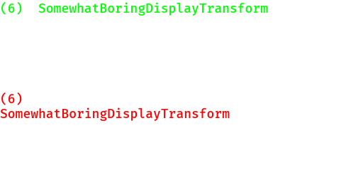

# Using the width of a buffer as the constraining width of another buffer does not produce the same result

See [main.rs](src/main.rs)

`cargo run` (see asserts in code)

or

`cargo run --features render` to generate an image `out.png` demonstrating the difference.

---

When we draw text in Bevy, we currently do 2+ passes (1+ node measurement pass, and 1 rendering pass); the calculated width from the first pass determines the size of the node.

A rare bug(?) occurs when laying out the text `(6)  SomewhatBoringDisplayTransform`
with a font size of `18.0` pixels and the font `FiraMono-Medium.ttf`.

We lay out this text in a buffer (`buffer1`) with an `UNBOUNDED` size; the buffer has one line (one layout run) with a certain `width1` (`run.line_w`).

Later, we lay out the same line in a buffer (`buffer2`) with a maximum size of `width1` pixels wide.

That is, the first buffer's width determines the width constraint of the second buffer. I expected that they would produce the same result.

However, this second buffer (`buffer2`) is not considered wide enough to fit that text, so the second word breaks onto a second line.

Even `ceil`ing the width still causes it to wrap, but `ceil`ing it and adding some small value (e.g. `0.001`) gets around this behaviour.
